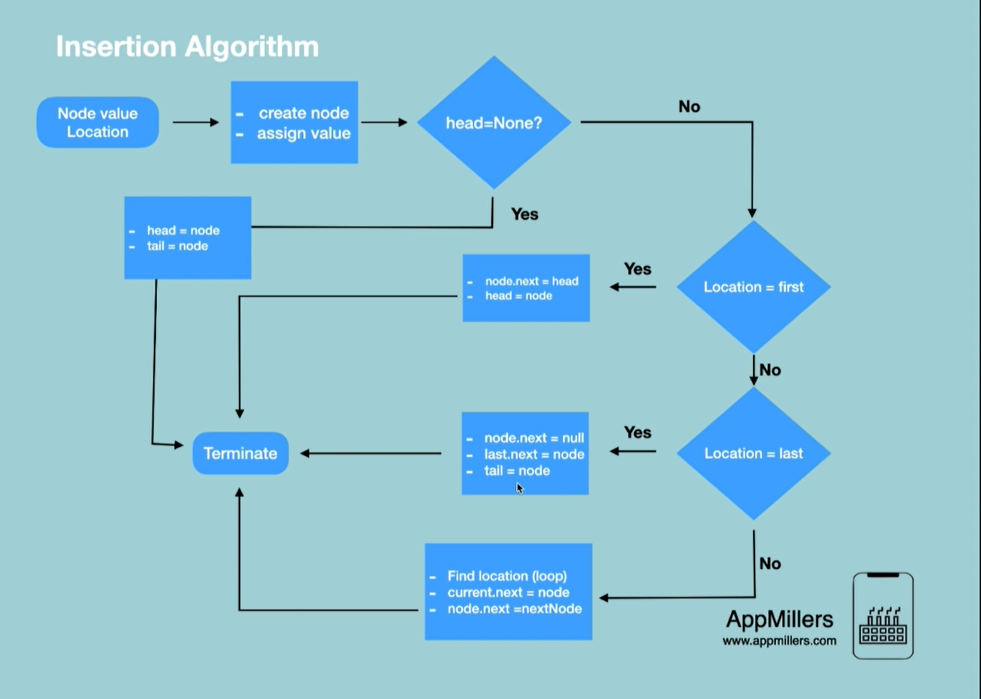
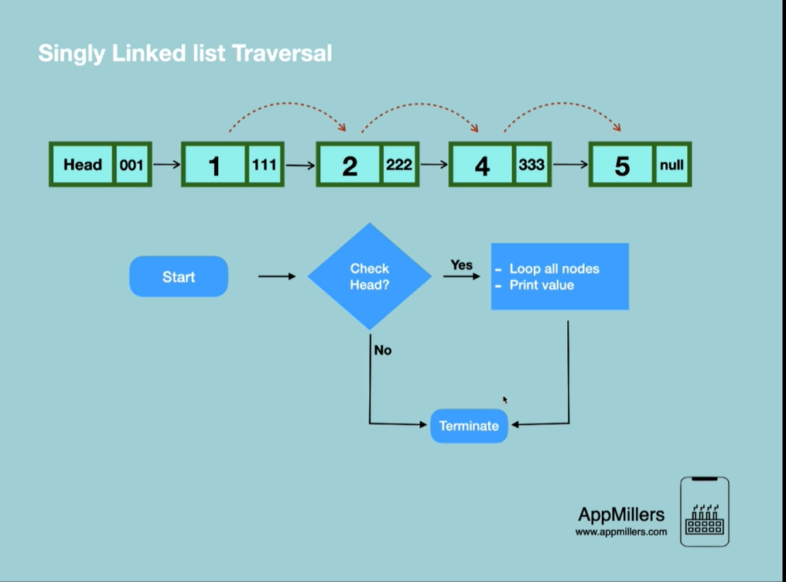
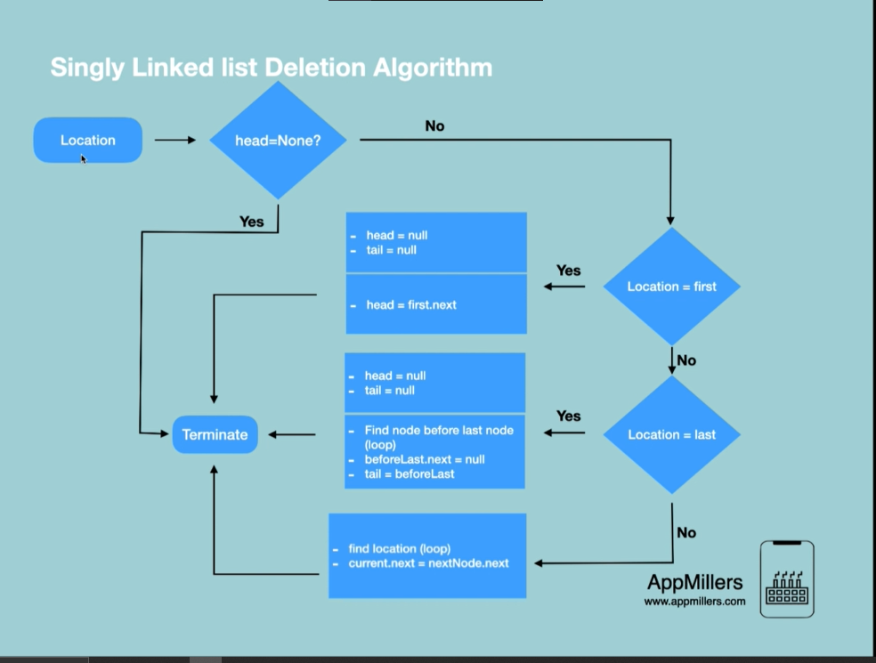
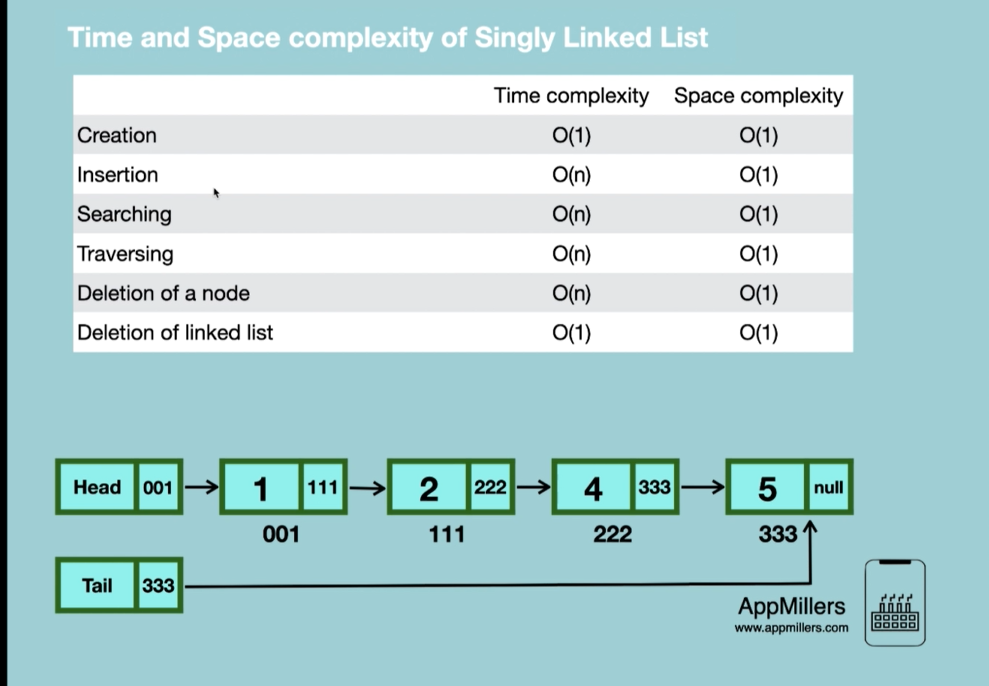
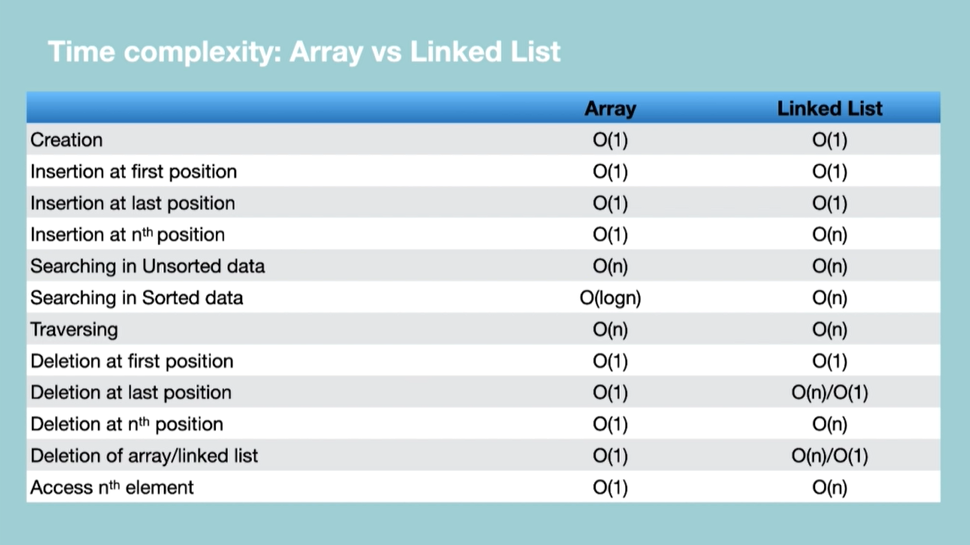

<!-- What  is Linked list -->

<!-- - element of linked list are independent objects and are not contiguous
- The size of the linked list is variable
- insertion and removals in linked list are very efficient
- Random access -accessing an element is very efficient in arrays -->

<!--
Type of Linked list

    -Singly linked List
    -Circular Linked list
    -Doubly Linked List
    -Circular Doubly LInked List

 -->

<!-- Insertion algorithm  -->

<!-- best image to understand insertion algorithm at different location  -->

<!--  Traversal linked lis

 -->

<!-- This is also another image for showing different case of deletion in the linked list
 -it depicts  deletion at the beginning ,at any index and at the end of the linked list -->

<!-- Revision of LinkedList  -->

<!-- Comparison of LInkedLIst and Array -->
